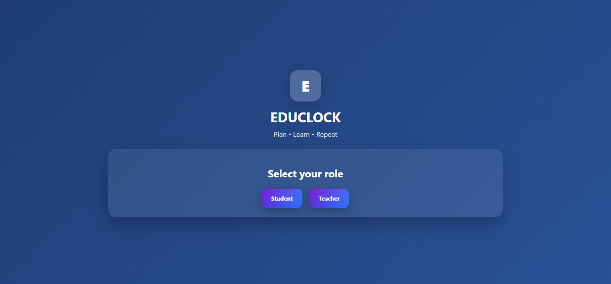
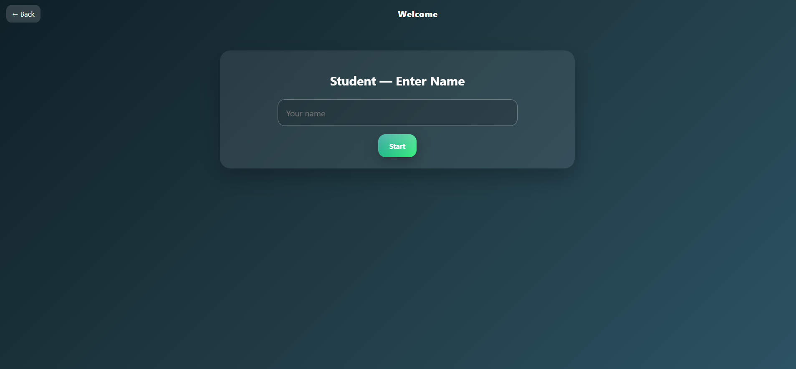
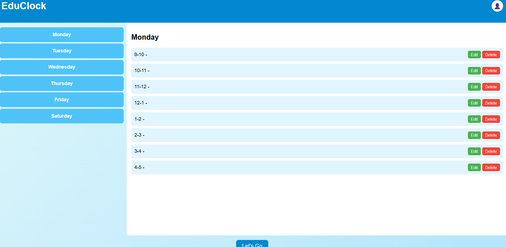
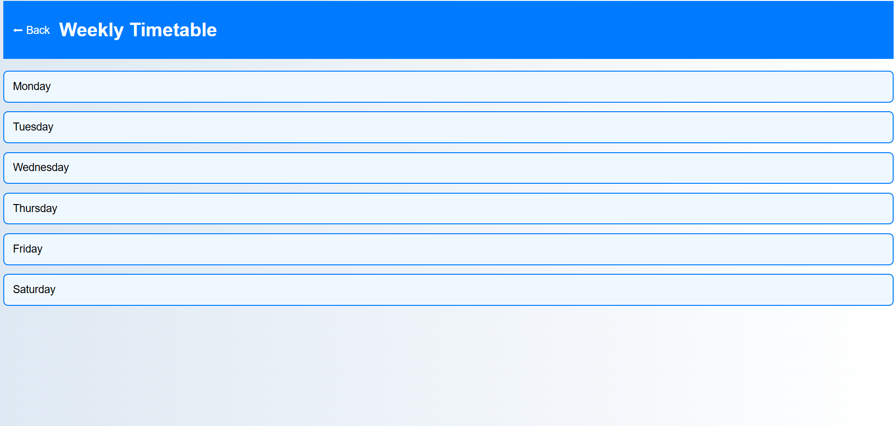

# ⏰ EduClock

EduClock is a smart timetable management app that helps students easily track their classes, Timings
---

## 🚀 Live Demo
👉 [Click Here to Open EduClock](https://abhiram812533.github.io/educlock/)

---

## 📸 Screenshots & Videos

### Role Screen

### Name View

### Entry

### Timetable

### Video

---

## 🎯 Features
- 📅 Create and manage weekly timetables  
- 🎨 Simple and clean UI  
- 📱 (works on mobile & desktop)  

---

## 🛠 Built With
- *HTML*  
- *CSS*  
- *JavaScript*  
- *Cordova (optional for APK build)*  
